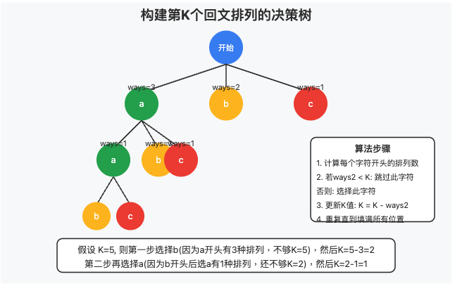

# Intuition

只需要考慮前半部分進行permutation, 同時想到`leetcode 31. nextPermutation`
所以brute force的話可以直接找出palindrome的前半部進行`k-1`次的next permutation
然後把後半拼接起來

```py
class Solution:
    def nextPermutation(self, nums: List[str]) -> None:
        """
        Do not return anything, modify nums in-place instead.
        """
        n = len(nums)
        i = n-1
        while i >= 1 and nums[i] <= nums[i-1]:
            i -= 1
        
        if i == 0:
            nums.sort()
            return False

        i -= 1 # swap position
        j = n-1
        while j > i and nums[j] <= nums[i]:
            j -= 1
        nums[i], nums[j] = nums[j], nums[i]

        nums[i+1:] = sorted(nums[i+1:])
        return True

    def smallestPalindrome(self, s: str, k: int) -> str:
        count = Counter(s)
        mid = ""
        letters = []
        for ch in count:
            if count[ch]%2 == 1:
                mid = ch
            
            if (freq:=count[ch]//2) > 0:
                letters += [ch]*freq

        letters.sort()
        for _ in range(k-1):
            if not self.nextPermutation(letters): return ""

        return "".join(letters) + mid + "".join(reversed(letters))
```

但這樣時間上會TLE(Time Limit Exceeded)

### 問題分析

這道題要求我們找出字符串 s 的第 k 個按字典序排列的回文排列。如果回文排列的數量少於k, 則返回空字符串。

### 關鍵點

我們需要考慮的是不同的回文排列
排列需要按照字典序排序
輸入字符串 s 保證是可以形成回文的

### 思路

對於回文字符串, 我們可以這樣思考:

如果字符串長度為奇數, 中間位置的字符是唯一的
剩餘字符需要成對出現, 左右對稱

實際上, 我們只需要確定前半部分字符的排列, 後半部分就被自動確定了。

### 主要解題步驟

1. 計算字符串前半部分中各字符的出現次數
2. 如果字符串長度為奇數, 中間位置的字符已經確定
3. 計算可能的回文排列總數, 看是否大於等於 k
4. 按字典序構建第 k 個回文排列

```py
class Solution:
    def smallestPalindrome(self, s: str, k: int) -> str:
        n = len(s)
        ans = [""] * n

        count = Counter(s[: n // 2])
        if n & 1:
            ans[n // 2] = s[n // 2]

        # Calcuate from right to left the number of ways to fill
        # this suffix.  If it is greater than K, we know the prefix
        # must be filled greedily.
        tot = 0
        ways = 1
        i = 0
        for c in sorted(count, reverse=True):
            tot += count[c]
            ways *= comb(tot, count[c])
            if ways > k:
                for c2 in sorted(count):
                    if c2 >= c:
                        break
                    for loops in range(count[c2]):
                        ans[i] = ans[~i] = c2
                        i += 1
                    count[c2] = 0

        # ways : the number of ways to arrange the letters in the left half
        ways = 1
        tot = sum(count.values())
        for ch in sorted(count):
            ways *= comb(tot, count[ch])
            tot -= count[ch]
        if ways < k:
            return ""

        tot = sum(count.values())
        while tot:
            for c in sorted(count):
                if count[c]:
                    ways2 = ways * count[c] // tot
                    if ways2 < k:
                        k -= ways2
                    else:
                        ans[i] = ans[~i] = c
                        i += 1
                        ways = ways2
                        count[c] -= 1
                        tot -= 1
                        break

        return "".join(ans)
```

### 關鍵點

#### 組合計數:

使用組合數學來計算不同排列的數量
comb(tot, count[c]) 表示從tot個位置中選count[c]個放置字符c的方式數


#### 貪心策略:

如果從某個字符c開始的後綴有足夠多種排列方式(>K), 則前綴必須按字典序貪心填充
這樣可以避免計算大於K的排列方式


#### 構建第K個排列:

按字典序逐步選擇字符
對於每個字符, 計算選擇它後剩余排列方式的數量
基於剩余數量和K的關系決定是否選擇該字符


#### 優化:

避免計算大型組合數
遞進式計算排列方式數量


這個算法利用了組合數學知識和貪心策略, 高效地找出了第K個回文排列, 而不需要生成所有可能的排列。

### 構建第K個排列的原理

當我們需要找出第K個排列時, 我們采用的是一種逐位選擇的方法。在每一步, 我們面臨一個選擇:應該在當前位置放哪個字符？
假設我們有剩余的字符 {'a': 2, 'b': 1, 'c': 1}, 總共4個字符需要安排, 並且需要找到第K個排列。



當我們需要構建第K個排列時, 關鍵在於:

計算每個可選字符的"貢獻":

如果我們在當前位置選擇字符c, 那麽有多少種不同的排列方式？
這個數量由公式計算: `ways2 = ways * count[c] // tot`

- ways 是當前總的排列方式
- count[c] 是字符c的剩余數量
- tot 是剩余需要排列的字符總數

決策規則:

如果選擇字符c後的排列數量 ways2 < K, 說明第K個排列不在這個字符開頭的排列中

我們跳過字符c, 並更新K: K = K - ways2


如果 ways2 >= K, 說明第K個排列在這個字符開頭的排列中

我們選擇字符c, 並繼續遞歸構建剩余位置


具體例子
假設我們有字符{'a':2, 'b':1, 'c':1}, 要找第5個排列:

初始狀態:

tot = 4 (總共4個字符)
ways = 12 (總共12種排列方式)


第一個位置:
按字典序遍歷 'a'、'b'、'c'

選'a':ways2 = 12 * 2 / 4 = 6

有6種排列, 但K=5, 所以第5個排列在'a'開頭的排列中
選擇'a', 並更新:ways=6, count['a']=1, tot=3, K不變


第二個位置:
按字典序遍歷 'a'、'b'、'c'

選'a':ways2 = 6 * 1 / 3 = 2

有2種排列, 但K=5仍然大於2
跳過'a', 更新:K=5-2=3


選'b':ways2 = 6 * 1 / 3 = 2

有2種排列, 但K=3仍然大於2
跳過'b', 更新:K=3-2=1


選'c':ways2 = 6 * 1 / 3 = 2

有2種排列, 且K=1小於等於2
選擇'c', 並更新:ways=2, count['c']=0, tot=2


後續位置:
繼續同樣的過程直到填滿所有位置


```python

tot = sum(count.values())
while tot:
    for c in sorted(count):  # 按字典序遍歷字符
        if count[c]:
            # 計算選擇字符c後剩余的排列方式數量
            ways2 = ways * count[c] // tot
            if ways2 < K:
                # 如果不包含第K個排列, 跳過字符c
                K -= ways2
            else:
                # 選擇字符c並更新狀態
                ans[i] = ans[~i] = c
                i += 1
                ways = ways2
                count[c] -= 1
                tot -= 1
                break  # 找到一個字符後退出循環
```

這段代碼的核心思想是:我們在每一步都按照字典序嘗試每個字符, 通過計算排列方式的數量來判斷第K個排列是否包含在當前字符開頭的排列中。如果是, 我們選擇該字符；如果不是, 我們調整K值並繼續嘗試下一個字符。
這種方法避免了生成所有排列, 直接構建了第K個排列, 大大提高了效率。
