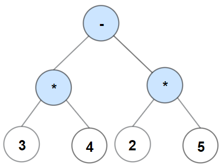

[1597. Build Binary Expression Tree From Infix Expression](https://leetcode.com/problems/build-binary-expression-tree-from-infix-expression/)

`Medium`

A binary expression tree is a kind of binary tree used to represent arithmetic expressions. Each node of a binary expression tree has either zero or two children. Leaf nodes (nodes with 0 children) correspond to operands (numbers), and internal nodes (nodes with 2 children) correspond to the operators '+' (addition), '-' (subtraction), '*' (multiplication), and '/' (division).

For each internal node with operator o, the infix expression that it represents is (A o B), where A is the expression the left subtree represents and B is the expression the right subtree represents.

You are given a string s, an infix expression containing operands, the operators described above, and parentheses '(' and ')'.

Return the binary expression tree, which its in-order traversal reproduce s.

Please note that order of operations applies in s. That is, expressions in parentheses are evaluated first, and multiplication and division happen before addition and subtraction.

Example 1:

Input: s = "2-3/(5*2)+1"
Output: [+,-,1,2,/,null,null,null,null,3,*,null,null,5,2]

Example 2:

Input: s = "3*4-2*5"
Output: [-,*,*,3,4,2,5]

Example 3:
Input: s = "1+2+3+4+5"
Output: [+,+,5,+,4,null,null,+,3,null,null,1,2]
 

Constraints:

- 1 <= s.length <= 10^5
- s consists of digits and the characters '+', '-', '*', '/', '(', and ')'.
- Operands in s are exactly 1 digit.
- It is guaranteed that s is a valid expression.