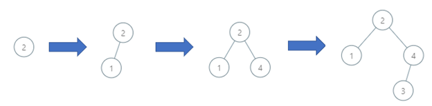
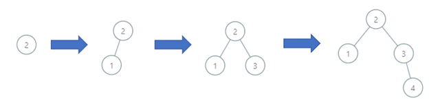
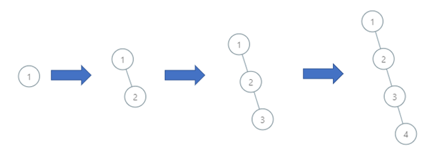

[1902. Depth of BST Given Insertion Order](https://leetcode.com/problems/depth-of-bst-given-insertion-order/)

`Medium`

You are given a 0-indexed integer array order of length n, a permutation of integers from 1 to n representing the order of insertion into a binary search tree.

A binary search tree is defined as follows:

The left subtree of a node contains only nodes with keys less than the node’s key.
The right subtree of a node contains only nodes with keys greater than the node’s key.
Both the left and right subtrees must also be binary search trees.
The binary search tree is constructed as follows:

order[0] will be the root of the binary search tree.
All subsequent elements are inserted as the child of any existing node such that the binary search tree properties hold.
Return the depth of the binary search tree.

A binary tree’s depth8* is the number of **nodes along the longest path from the root node down to the farthest leaf node.

Example 1:

Input: order = [2,1,4,3]
Output: 3
Explanation: The binary search tree has a depth of 3 with path 2->3->4.

Example 2:

Input: order = [2,1,3,4]
Output: 3
Explanation: The binary search tree has a depth of 3 with path 2->3->4.

Example 3:

Input: order = [1,2,3,4]
Output: 4
Explanation: The binary search tree has a depth of 4 with path 1->2->3->4.

Constraints:

- n == order.length
- 1 <= n <= 10^5
- order is a permutation of integers between 1 and n.