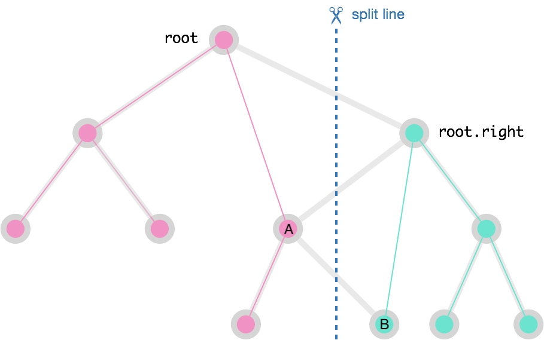

[776. Split BST](https://leetcode.com/problems/split-bst/)

Given a Binary Search Tree (BST) with root node root, and a target value V, split the tree into two subtrees where one subtree has nodes that are all smaller or equal to the target value, while the other subtree has all nodes that are greater than the target value.  It's not necessarily the case that the tree contains a node with value V.

Additionally, most of the structure of the original tree should remain.  Formally, for any child C with parent P in the original tree, if they are both in the same subtree after the split, then node C should still have the parent P.

You should output the root TreeNode of both subtrees after splitting, in any order.

Example 1:
Input: root = [4,2,6,1,3,5,7], V = 2
Output: [[2,1],[4,3,6,null,null,5,7]]
Explanation:
Note that root, output[0], and output[1] are TreeNode objects, not arrays.

The given tree [4,2,6,1,3,5,7] is represented by the following diagram:
```
          4
        /   \
      2      6
     / \    / \
    1   3  5   7
```
while the diagrams for the outputs are:
```
          4
        /   \
      3      6      and    2
            / \           /
           5   7         1
```

Note:

- The size of the BST will not exceed 50.
- The BST is always valid and each node's value is different.

<details>
<summary>Hint</summary>



</details>